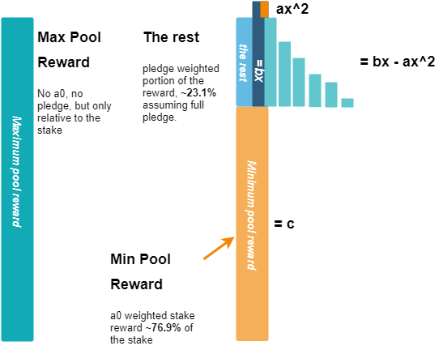

# Demystifying RSS

This is a placeholder for the 'Demystifying RSS' for Cardano presentation hold by @ilap.

Recorded: Fri 11 Dec 21:00:00 UTC 2020

- [The desmos graph link](https://www.desmos.com/calculator/skl0gevqfz)
# Diagrams

The following diagrams were used in the presentation.

Click on the selected diagram to open it in [Draw.io](https://draw.io)

__Disclaimer__: These diagrams are not accurate, even they can be completely wrong.

## Pool's reward calculation

## Pool's reward splitting/distribution

## Simple Explanation

